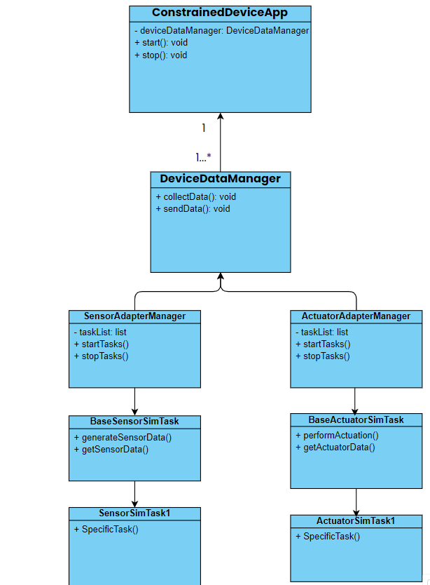
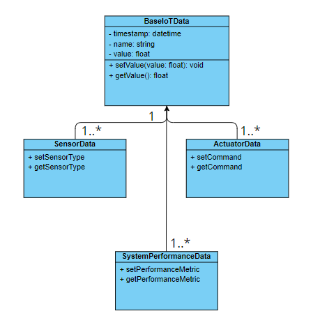

# Constrained Device Application (Connected Devices)

## Lab Module 03

Be sure to implement all the PIOT-CDA-* issues (requirements) listed at [PIOT-INF-03-001 - Lab Module 03](https://github.com/orgs/programming-the-iot/projects/1#column-10488379).

### Description

NOTE: Include two full paragraphs describing your implementation approach by answering the questions listed below.

What does your implementation do? 

The implementation consists of creating and/or editing Python modules that define data structures and simulation tasks for IoT sensor and actuator management. Specifically, the tasks involve creating classes for managing sensor data (SensorData), actuator data (ActuatorData), and system performance data (SystemPerformanceData), all derived from a base class BaseIotData. These classes store and process the sensor and actuator-related data. Additionally, sensor and actuator simulation tasks will be implemented to emulate the behavior of real devices.

A key part of the system is the management layer, consisting of SensorAdapterManager and ActuatorAdapterManager, which will handle scheduling and managing these sensor and actuator simulations. The DeviceDataManager will oversee the entire system’s data flow and interact with the sensors and actuators.

How does your implementation work?

1. BaseIotData and Subclasses:

The BaseIotData class serves as the parent class for various data classes such as SensorData, ActuatorData, and SystemPerformanceData. These subclasses hold specific data for IoT devices, like sensor readings or actuator commands.

SensorData: Holds data related to sensors, like temperature or humidity readings.

ActuatorData: Manages the state and actions of actuators (e.g., turning devices on/off).

SystemPerformanceData: Tracks metrics such as CPU or memory usage.

2. BaseSensorSimTask and BaseActuatorSimTask:

These modules define the base simulation behavior for sensors and actuators. They simulate sensor data generation and actuator responses using simple logic or random values.

Sensor simulators extend from BaseSensorSimTask and emulate reading data from sensors.

Actuator simulators extend from BaseActuatorSimTask and emulate actions like turning on/off devices or setting states.

3. SensorAdapterManager and ActuatorAdapterManager:

These managers control the lifecycle of sensor and actuator simulators. They use the APScheduler library to schedule and manage tasks related to running sensor and actuator simulators.

4. SensorAdapterManager: Responsible for managing multiple sensor simulators by starting, stopping, and scheduling them.

5. ActuatorAdapterManager: Manages actuator simulators in a similar way, controlling their simulated actions.

6. DeviceDataManager:

Acts as the central data manager in the system, overseeing the flow of data between sensors, actuators, and other system components. It invokes tasks like starting or stopping simulations, and gathers sensor and actuator data.
7. ConstrainedDeviceApp:

The main application integrates all these components. It creates an instance of DeviceDataManager and manages the start and stop lifecycle of the entire system through DeviceDataManager’s methods.

### Code Repository and Branch

NOTE: Be sure to include the branch (e.g. https://github.com/programming-the-iot/python-components/tree/alpha001).

URL: https://github.com/zo1235/python-components/tree/lab03

### UML Design Diagram(s)

NOTE: Include one or more UML designs representing your solution. It's expected each
diagram you provide will look similar to, but not the same as, its counterpart in the
book [Programming the IoT](https://learning.oreilly.com/library/view/programming-the-internet/9781492081401/).

### Unit Tests Executed

NOTE: TA's will execute your unit tests. You only need to list each test case below
(e.g. ConfigUtilTest, DataUtilTest, etc). Be sure to include all previous tests, too,
since you need to ensure you haven't introduced regressions.

- ./data/ActuatorDataTest
./data/SensorDataTest
./data/SystemPerformanceDataTest
./sim/HumiditySensorSimTaskTest
./sim/PressureSensorSimTaskTest
./sim/TemperatureSensorSimTaskTest
./sim/HumidifierActuatorSimTaskTest
./sim/HvacActuatorSimTaskTest
- 
- 

### Integration Tests Executed

NOTE: TA's will execute most of your integration tests using their own environment, with
some exceptions (such as your cloud connectivity tests). In such cases, they'll review
your code to ensure it's correct. As for the tests you execute, you only need to list each
test case below (e.g. SensorSimAdapterManagerTest, DeviceDataManagerTest, etc.)

- SensorAdapterManagerTest
- ActuatorAdapterManagerTest
- DeviceDataManagerNoCommsTest
- ConstrainedDeviceAppTest

EOF.
