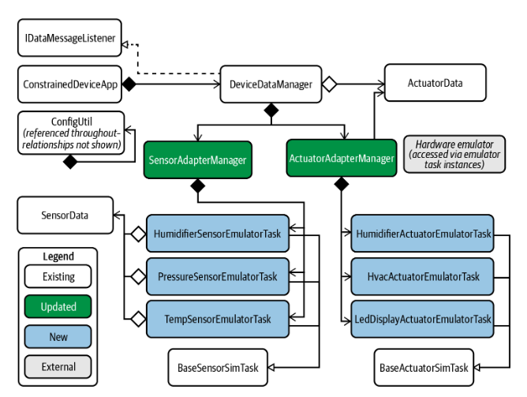

# Constrained Device Application (Connected Devices)

## Lab Module 04

Be sure to implement all the PIOT-CDA-* issues (requirements) listed at [PIOT-INF-04-001 - Lab Module 04](https://github.com/orgs/programming-the-iot/projects/1#column-10488386).

### Description

NOTE: Include two full paragraphs describing your implementation approach by answering the questions listed below.

What does your implementation do? 
My implementation creates Python modules to simulate sensor and actuator tasks using the Pisense and Sense-Emu libraries. 
These modules mimic real-world IoT devices like temperature, humidity, and pressure sensors, as well as actuators, by providing emulated functionality. 
The emulator allows these sensor and actuator tasks to be performed without physical hardware. Additionally, the implementation updates the SensorAdapterManager and ActuatorAdapterManager modules to handle the interaction between the emulated sensors/actuators and the system using the SenseHAT emulator.

How does your implementation work?
The implementation works by inheriting from base classes, BaseSensorSimTask and BaseActuatorSimTask, which provide foundational functionality for sensor and actuator tasks. 
The emulator modules are structured to follow the design of their simulator counterparts but with additional detailed implementations for sensor and actuator emulation. 
The SenseHAT emulator is integrated through the SensorAdapterManager and ActuatorAdapterManager classes, which coordinate the flow of sensor data and actuator commands in the simulated environment. 
The Pisense and Sense-Emu libraries enable the simulation of sensors, allowing for testing IoT systems in a controlled, virtual environment that mimics real-world device behavior.

### Code Repository and Branch

NOTE: Be sure to include the branch (e.g. https://github.com/programming-the-iot/python-components/tree/alpha001).

URL: https://github.com/zo1235/python-components/tree/lab04

### UML Design Diagram(s)

NOTE: Include one or more UML designs representing your solution. It's expected each
diagram you provide will look similar to, but not the same as, its counterpart in the
book [Programming the IoT](https://learning.oreilly.com/library/view/programming-the-internet/9781492081401/).

### Unit Tests Executed

NOTE: TA's will execute your unit tests. You only need to list each test case below
(e.g. ConfigUtilTest, DataUtilTest, etc). Be sure to include all previous tests, too,
since you need to ensure you haven't introduced regressions.

- 
- 
- NA

### Integration Tests Executed

NOTE: TA's will execute most of your integration tests using their own environment, with
some exceptions (such as your cloud connectivity tests). In such cases, they'll review
your code to ensure it's correct. As for the tests you execute, you only need to list each
test case below (e.g. SensorSimAdapterManagerTest, DeviceDataManagerTest, etc.)

- HumidityEmulatorTaskTest.py
-PressureEmulatorTaskTest.py
-TemperatureEmulatorTaskTest.py
- HumidifierEmulatorTaskTest.py
-HvacEmulatorTaskTest.py
-LedDisplayEmulatorTaskTest.py
-SensorEmulatorManagerTest.py
-ActuatorEmulatorManagerTest

EOF.
