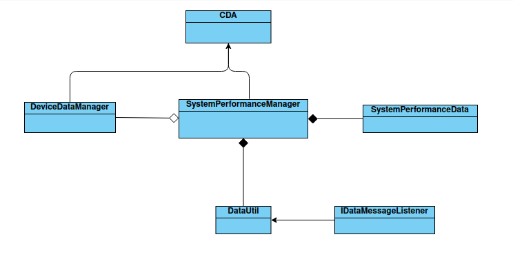

# Constrained Device Application (Connected Devices)

## Lab Module 05

Be sure to implement all the PIOT-CDA-* issues (requirements) listed at [PIOT-INF-05-001 - Lab Module 05](https://github.com/orgs/programming-the-iot/projects/1#column-10488421).

### Description

NOTE: Include two full paragraphs describing your implementation approach by answering the questions listed below.

What does your implementation do? 

My implementation achieves the following:

    Collects system performance data: It captures telemetry data like CPU utilization, memory usage, and disk utilization within the SystemPerformanceManager class.

    Stores data in SystemPerformanceData: The telemetry data is organized and stored in a SystemPerformanceData object for easier processing and management.

    Notifies listeners when new data is available: If an IDataMessageListener reference is set, my implementation invokes the relevant callback method whenever new SystemPerformanceData is created. This ensures that any component interested in system performance updates gets notified immediately.

    Handles data conversions (if in Python): The DataUtil class in Python handles serialization and deserialization of the system performance data, converting the data to and from JSON format, enabling smooth data communication between systems.

How does your implementation work?

Step 1: Collecting telemetry in SystemPerformanceManager: The handleTelemetry() method within SystemPerformanceManager collects system performance data (like CPU, memory, and disk utilization). After gathering this data, it creates an instance of SystemPerformanceData and stores the collected data in it.

Step 2: Storing data in SystemPerformanceData: The data collected by handleTelemetry() is organized into the appropriate fields of SystemPerformanceData. This object acts as a container for system performance metrics.

Step 3: Checking IDataMessageListener: Before notifying any listener, the implementation checks if the IDataMessageListener is set (i.e., it’s not null). If the listener is available, the implementation proceeds to the next step.

Step 4: Notifying IDataMessageListener: If a listener is available, the relevant callback method (like onSystemPerformanceDataUpdate()) is invoked with the newly created SystemPerformanceData instance. This ensures that the listener receives real-time updates on system performance.

Step 5: DataUtil in Python: In the Python module, the DataUtil class is responsible for converting the SystemPerformanceData object to JSON format (and vice versa). This allows for easy storage, logging, or transmission of the performance data across systems.

### Code Repository and Branch

NOTE: Be sure to include the branch (e.g. https://github.com/programming-the-iot/python-components/tree/alpha001).

URL: https://github.com/zo1235/python-components/tree/lab05

### UML Design Diagram(s)

NOTE: Include one or more UML designs representing your solution. It's expected each
diagram you provide will look similar to, but not the same as, its counterpart in the
book [Programming the IoT](https://learning.oreilly.com/library/view/programming-the-internet/9781492081401/).

### Unit Tests Executed

NOTE: TA's will execute your unit tests. You only need to list each test case below
(e.g. ConfigUtilTest, DataUtilTest, etc). Be sure to include all previous tests, too,
since you need to ensure you haven't introduced regressions.

- DataUtilTest
- SystemPerformanceData
- ActuatorDataTest
-SensorDataTest
-HumidifierActuatorSimTask
-TemperatureSensorSimTask

### Integration Tests Executed

NOTE: TA's will execute most of your integration tests using their own environment, with
some exceptions (such as your cloud connectivity tests). In such cases, they'll review
your code to ensure it's correct. As for the tests you execute, you only need to list each
test case below (e.g. SensorSimAdapterManagerTest, DeviceDataManagerTest, etc.)

- CDA
- SystemPerformanceManager
- DataIntegration
- SensorAdapterManagerTest
- ActuatorAdapterManagerTest
- DeviceDataManagerNoCommsTest

EOF.
