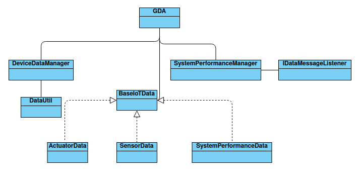

# Gateway Device Application (Connected Devices)

## Lab Module 05

Be sure to implement all the PIOT-GDA-* issues (requirements) listed at [PIOT-INF-05-001 - Lab Module 05](https://github.com/orgs/programming-the-iot/projects/1#column-10488421).

### Description

NOTE: Include two full paragraphs describing your implementation approach by answering the questions listed below.

What does your implementation do? 

The implementation described in the instructions sets up a system to handle and process various types of IoT data, including sensor data, actuator data, and system performance data. These data types are all derived from a base class, BaseIotData, and are managed and processed through modules in the system. The implementation does the following:

    Creates and organizes data classes:
        SensorData, ActuatorData, SystemPerformanceData, and SystemStateData, each derived from BaseIotData.
        These classes will handle data for sensors and actuators within the IoT system, as well as track system performance and state.

    Data management:
        A new class called DeviceDataManager will manage the data flow in the system and communicate with the GatewayDeviceApp through its start and stop methods.
        The system ensures that all data (e.g., sensor and actuator data) is labeled with a consistent naming convention, using constants from ConfigConst.

    Telemetry handling:
        SystemPerformanceManager will collect system telemetry (e.g., CPU and memory usage) and store it in SystemPerformanceData. If a listener (IDataMessageListener) is set, it will send updates when new performance data is created.

    Serialization and Data Transformation:
        A utility class DataUtil will be used for data serialization and potentially other data-related utility functions.

How does your implementation work?

The system follows an object-oriented approach to structure and manage IoT data and performance telemetry. Here's how it works:

    Data Classes:
        Each data class (SensorData, ActuatorData, SystemPerformanceData, SystemStateData) inherits from BaseIotData, providing a consistent structure for storing and managing different kinds of data.
        These classes will likely include properties such as name, type, and other attributes relevant to the type of data they represent.

    System Performance Manager:
        The SystemPerformanceManager is responsible for collecting telemetry data (like CPU and memory utilization) via the handleTelemetry() method. This data is encapsulated in a SystemPerformanceData instance.
        If an IDataMessageListener instance is set, the SystemPerformanceManager will notify it whenever new performance data is available, thus enabling real-time telemetry reporting.

    Data Manager and Gateway Integration:
        DeviceDataManager manages the overall lifecycle of the data in the system (e.g., receiving, storing, and sending data).
        GatewayDeviceApp instantiates DeviceDataManager and calls its start and stop methods, ensuring that the data manager operates within the lifecycle of the app.

    Consistent Naming Conventions:
        The implementation relies on ConfigConst to enforce consistent naming of devices and data labels, making sure that all the IoT components use the same naming scheme for easier integration with other systems, like cloud platforms.

    Data Utility (DataUtil):
        This utility class will handle data-related tasks such as serialization, data format transformation, or other common operations that might be needed when processing IoT data.

### Code Repository and Branch

NOTE: Be sure to include the branch (e.g. https://github.com/programming-the-iot/python-components/tree/alpha001).

URL: https://github.com/zo1235/java-components/tree/lab05

### UML Design Diagram(s)

NOTE: Include one or more UML designs representing your solution. It's expected each
diagram you provide will look similar to, but not the same as, its counterpart in the
book [Programming the IoT](https://learning.oreilly.com/library/view/programming-the-internet/9781492081401/).

### Unit Tests Executed

NOTE: TA's will execute your unit tests. You only need to list each test case below
(e.g. ConfigUtilTest, DataUtilTest, etc). Be sure to include all previous tests, too,
since you need to ensure you haven't introduced regressions.

- ActuatorDataTest
- SensorDataTest
- SystemPerformanceDataTest
- DataUtilTest

### Integration Tests Executed

NOTE: TA's will execute most of your integration tests using their own environment, with
some exceptions (such as your cloud connectivity tests). In such cases, they'll review
your code to ensure it's correct. As for the tests you execute, you only need to list each
test case below (e.g. SensorSimAdapterManagerTest, DeviceDataManagerTest, etc.)

- GDA
- DataIntegrationTest
- SystemPerformanceManagerTest
- -DeviceDataManagerTest

EOF.
