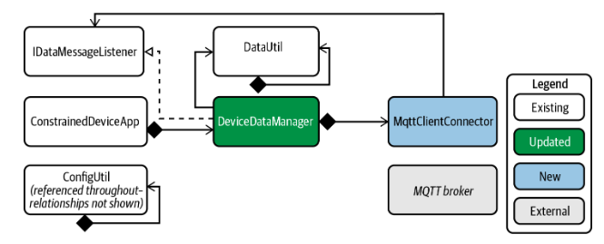

# Constrained Device Application (Connected Devices)

## Lab Module 06

Be sure to implement all the PIOT-CDA-* issues (requirements) listed at [PIOT-INF-06-001 - Lab Module 06](https://github.com/orgs/programming-the-iot/projects/1#column-10488434).

### Description

NOTE: Include two full paragraphs describing your implementation approach by answering the questions listed below.

What does your implementation do? 

The MqttClientConnector module establishes a connection between a device and an MQTT broker, enabling the device to publish and subscribe to messages. 
It handles MQTT client events such as connecting, disconnecting, and receiving messages, facilitating effective communication within IoT applications. 
Additionally, it integrates with the DeviceDataManager to ensure the MQTT client connects at startup and disconnects at shutdown.

How does your implementation work?

Module Creation: A new Python module named MqttClientConnector is created, containing a class MqttClientConnector that implements the IPubSubClient interface.

Callbacks: The class includes callback methods to handle:

    Connect Events: Actions to perform when the MQTT client successfully connects to the broker.
    Disconnect Events: Actions to take when the client disconnects from the broker.
    Message Received Events: Handling incoming messages from the broker.

Publish and Subscribe Functions: The module provides methods to:

    Publish: Send messages to specific topics on the MQTT broker.
    Subscribe: Listen for messages on specified topics, allowing the client to receive updates.

Integration with DeviceDataManager: The MqttClientConnector is integrated into the DeviceDataManager class to:

    Automatically connect to the MQTT broker when the device starts.
    Ensure a clean disconnection from the broker when the device stops, maintaining resource efficiency and avoiding potential connection issues.

### Code Repository and Branch

NOTE: Be sure to include the branch (e.g. https://github.com/programming-the-iot/python-components/tree/alpha001).

URL: https://github.com/zo1235/python-components/tree/lab06

### UML Design Diagram(s)

NOTE: Include one or more UML designs representing your solution. It's expected each
diagram you provide will look similar to, but not the same as, its counterpart in the
book [Programming the IoT](https://learning.oreilly.com/library/view/programming-the-internet/9781492081401/).

### Unit Tests Executed

NOTE: TA's will execute your unit tests. You only need to list each test case below
(e.g. ConfigUtilTest, DataUtilTest, etc). Be sure to include all previous tests, too,
since you need to ensure you haven't introduced regressions.

- MqttClientConnectorTest
- DataUtilTest
- SystemPerformanceData
- ActuatorDataTest
-SensorDataTest
-HumidifierActuatorSimTask
-TemperatureSensorSimTask
- 

### Integration Tests Executed

NOTE: TA's will execute most of your integration tests using their own environment, with
some exceptions (such as your cloud connectivity tests). In such cases, they'll review
your code to ensure it's correct. As for the tests you execute, you only need to list each
test case below (e.g. SensorSimAdapterManagerTest, DeviceDataManagerTest, etc.)

- CDA
- SystemPerformanceManager
- DataIntegration
- SensorAdapterManagerTest
- ActuatorAdapterManagerTest
- DeviceDataManagerNoCommsTest
- 

EOF.
