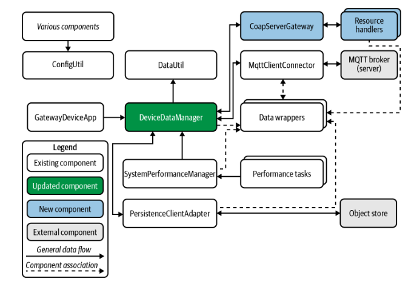

# Gateway Device Application (Connected Devices)

## Lab Module 08

Be sure to implement all the PIOT-GDA-* issues (requirements) listed at [PIOT-INF-08-001 - Lab Module 08](https://github.com/orgs/programming-the-iot/projects/1#column-10488501).

### Description

NOTE: Include two full paragraphs describing your implementation approach by answering the questions listed below.

What does your implementation do?

Through a Java class called CoapServerGateway, which acts as an adaptor for the Eclipse Californium CoAP server, this solution offers CoAP server capability. A number of CoAP resources for managing device data are hosted by the CoapServerGateway, including the capacity to watch actuator instructions and receive sensor data and system performance updates. The DeviceDataManager, which controls sensor and actuator data across IoT devices, is connected to the CoAP server. Clients can make PUT requests with system performance and telemetry data thanks to the implementation of two new resource handlers (UpdateSystemPerformanceResourceHandler and UpdateTelemetryResourceHandler), which enable flexible interaction with sensor and actuator data. Furthermore, the gateway device can alert the CDA to any revisions to actuator instructions by implementing the GetActuatorCommandResourceHandler, which supports watching actuator commands based on the CoAP OBSERVE protocol.

How does your implementation work?

For CoAP functionality, the implementation uses the californium-core and scandium-core CoAP libraries from the Eclipse Foundation. A flexible design is made possible by the integration of the CoapServerGateway with the DeviceDataManager, which allows resources to be produced internally or provided from external sources. In order to maintain effective device connection, the DeviceDataManager has been modified to register an IActuatorDataListener, which allows it to receive actuator data updates from the CoAP server. To confirm the CoAP server's functioning, including resource discovery and fundamental client-server communication, an integration test called CoapServerGatewayTest is developed.

### Code Repository and Branch

NOTE: Be sure to include the branch (e.g. https://github.com/programming-the-iot/python-components/tree/alpha001).

URL: https://github.com/zo1235/java-components/tree/lab08

### UML Design Diagram(s)

NOTE: Include one or more UML designs representing your solution. It's expected each
diagram you provide will look similar to, but not the same as, its counterpart in the
book [Programming the IoT](https://learning.oreilly.com/library/view/programming-the-internet/9781492081401/).

### Unit Tests Executed

NOTE: TA's will execute your unit tests. You only need to list each test case below
(e.g. ConfigUtilTest, DataUtilTest, etc). Be sure to include all previous tests, too,
since you need to ensure you haven't introduced regressions.

- ConfigUtilTest: Verifies the functioning of configuration utilities.
CoapServerAdapterTest: Verifies the functionality of the CoAP server adapter.
DeviceDataManagerTest: Confirms procedures for managing device data.
- 
- 

### Integration Tests Executed

NOTE: TA's will execute most of your integration tests using their own environment, with
some exceptions (such as your cloud connectivity tests). In such cases, they'll review
your code to ensure it's correct. As for the tests you execute, you only need to list each
test case below (e.g. SensorSimAdapterManagerTest, DeviceDataManagerTest, etc.)

- CoapClientToServerConnectorTest.
CoapServerGatewayTest: Verifies connection and resource discovery for CoAP servers.
ActuatorCommandObserverTest: Tracks the transmission of actuator commands.
- 
- 

EOF.
