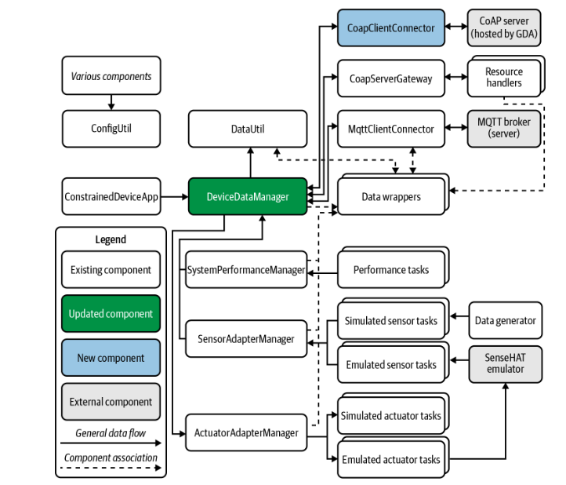

# Constrained Device Application (Connected Devices)

## Lab Module 09

Be sure to implement all the PIOT-CDA-* issues (requirements) listed at [PIOT-INF-09-001 - Lab Module 09](https://github.com/orgs/programming-the-iot/projects/1#column-10488503).

### Description

NOTE: Include two full paragraphs describing your implementation approach by answering the questions listed below.

What does your implementation do? 

The CoapClientConnector module is designed to handle communication between a CoAP (Constrained Application Protocol) client and a server in an IoT environment. 
It implements the IRequestResponse interface and is structured to handle various types of CoAP requests like GET, PUT, POST, DELETE, and OBSERVE. 
This module uses one of two libraries—CoAPthon3 or aiocoap—to facilitate these requests, depending on which library is chosen.

How does your implementation work?

1. CoapClientConnector Class:

    This class is implemented to conform to the IRequestResponse interface, which is likely designed to standardize how requests and responses are handled.
    It leverages one of the two CoAP libraries (CoAPthon3 or aiocoap) to send requests and receive responses over the CoAP protocol. The implementation will vary based on the selected library but will generally handle the basic request-response flow.

2. GET Requests:

    The CoapClientConnector class sends a GET request to a CoAP server to retrieve data. It handles the response from the server, which could include the requested data or an error.
    The implementation follows the existing method definitions within IRequestResponseHandler to properly support the GET request type.

3. PUT Requests:

    The class will send a PUT request to update or modify data on a CoAP server.
    It will use the IRequestResponseHandler to properly integrate the PUT request handling with the CoAP communication.

4. POST Requests:

    Similarly to PUT, POST requests are used to submit new data to a CoAP server. The CoapClientConnector will construct the POST request and handle the server's response, including handling success or failure as defined by the IRequestResponseHandler interface.

5. DELETE Requests:

    DELETE requests are sent to remove or delete data from the CoAP server. The class will issue the DELETE request and handle the server's response accordingly, ensuring the correct method is used from IRequestResponseHandler.

6. OBSERVE Requests:

    OBSERVE is a special CoAP request where the client subscribes to notifications for a resource, receiving updates when the resource changes. The CoapClientConnector will be updated to support OBSERVE requests, managing the continuous flow of updates from the CoAP server. This involves setting up the necessary subscription to observe the resource.

7. Integration with DeviceDataManager:

    The CoapClientConnector class is connected to the DeviceDataManager, which likely acts as the central hub managing data from various IoT devices. The CoapClientConnector will handle interactions with CoAP-based resources, and the results of those interactions will be used by the DeviceDataManager to manage and process data in the broader system.

### Code Repository and Branch

NOTE: Be sure to include the branch (e.g. https://github.com/programming-the-iot/python-components/tree/alpha001).

URL: https://github.com/zo1235/python-components/tree/lab09

### UML Design Diagram(s)

NOTE: Include one or more UML designs representing your solution. It's expected each
diagram you provide will look similar to, but not the same as, its counterpart in the
book [Programming the IoT](https://learning.oreilly.com/library/view/programming-the-internet/9781492081401/).

### Unit Tests Executed

NOTE: TA's will execute your unit tests. You only need to list each test case below
(e.g. ConfigUtilTest, DataUtilTest, etc). Be sure to include all previous tests, too,
since you need to ensure you haven't introduced regressions.

- CoapServerAdapterTest: Examines resource registration, server startup, and the fundamentals of managing CoAP requests. DeviceDataManagerTest: Confirms that DeviceDataManager can handle data and manage resources. ConfigUtilTest: Verifies that ConfigUtil is used to load and access configurations.
- 
- 

### Integration Tests Executed

NOTE: TA's will execute most of your integration tests using their own environment, with
some exceptions (such as your cloud connectivity tests). In such cases, they'll review
your code to ensure it's correct. As for the tests you execute, you only need to list each
test case below (e.g. SensorSimAdapterManagerTest, DeviceDataManagerTest, etc.)

-CoapClientConnectorTest 
CoapClientToServerConnectorTest: Verifies client-server communication using CoAP protocols. SensorDataObserverTest: Verifies the functioning of observer patterns for updates to sensor data. SystemPerformanceDataObserverTest: Examines alerting systems for modifications in system performance data.
- 
- 

EOF.
