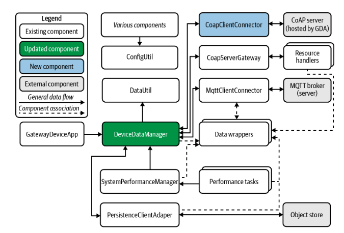

# Constrained Device Application (Connected Devices)

## Lab Module 09

Be sure to implement all the PIOT-CDA-* issues (requirements) listed at [PIOT-INF-09-001 - Lab Module 09](https://github.com/orgs/programming-the-iot/projects/1#column-10488503).

### Description

NOTE: Include two full paragraphs describing your implementation approach by answering the questions listed below.

What does your implementation do? 

The CoapClientConnector class is a Java implementation designed to facilitate communication between a CoAP (Constrained Application Protocol) client and a server in an IoT environment. This class implements the IRequestResponse interface and provides functionalities for various types of CoAP requests such as GET, PUT, POST, DELETE, as well as device discovery. Additionally, a GenericCoapResponseHandler class is created to handle responses, implementing the CoapHandler interface to process the server's responses.

How does your implementation work?

1. CoapClientConnector Class:

    This class implements the IRequestResponse interface, which provides a standardized way to handle requests and responses.
    The CoapClientConnector class will be responsible for initiating and managing CoAP requests, using an appropriate CoAP library (such as CoAPthon3 or aiocoap, as mentioned in the instructions) to communicate with CoAP servers.
    The class will be updated to handle various CoAP request types (GET, PUT, POST, DELETE) and will include functionality for discovering devices in the network.

2. Discovery Functionality:

    CoapClientConnector will be updated to support discovery functionality, which means it will be capable of discovering available CoAP resources or servers on the network. This is crucial for IoT applications, where devices or servers may dynamically join or leave the network.
    Device discovery can be implemented using CoAP multicast or other CoAP-specific discovery mechanisms, allowing the client to identify available devices or services in the network.

3. GET Requests:

    The class will handle GET requests using the existing method definitions within IRequestResponseHandler. A GET request is used to retrieve resources from a CoAP server.
    When a GET request is issued, the CoapClientConnector will use the chosen CoAP library to send the request and handle the server's response. The response will be processed using the GenericCoapResponseHandler.

4. PUT Requests:

    PUT requests are used to update or modify existing resources on the CoAP server. The CoapClientConnector will send a PUT request to the server and use the IRequestResponseHandler interface to process the response.
    The PUT method will be implemented by updating the server with new data or modifying an existing resource.

5. POST Requests:

    POST requests are used to create new resources on a CoAP server or submit data for processing. The CoapClientConnector will send a POST request and handle the response using the IRequestResponseHandler interface.
    This functionality is crucial for scenarios where new data or configurations need to be submitted to a CoAP server.

6. DELETE Requests:

    DELETE requests are used to remove resources or data from the CoAP server. The CoapClientConnector class will issue a DELETE request to the server, using the IRequestResponseHandler interface to handle the response.
    The DELETE request will ensure that the resource or data is removed from the server, and the response will be processed accordingly.

7. GenericCoapResponseHandler Class:

    The GenericCoapResponseHandler implements the CoapHandler interface and is responsible for processing responses from the CoAP server.
    The handler will define methods for processing different types of responses, such as success, error, or timeout.
    This class will be used by the CoapClientConnector to handle the responses to GET, PUT, POST, DELETE, and discovery requests.

### Code Repository and Branch

NOTE: Be sure to include the branch (e.g. https://github.com/programming-the-iot/python-components/tree/alpha001).

URL: https://github.com/zo1235/java-components/tree/lab09

### UML Design Diagram(s)

NOTE: Include one or more UML designs representing your solution. It's expected each
diagram you provide will look similar to, but not the same as, its counterpart in the
book [Programming the IoT](https://learning.oreilly.com/library/view/programming-the-internet/9781492081401/).

### Unit Tests Executed

NOTE: TA's will execute your unit tests. You only need to list each test case below
(e.g. ConfigUtilTest, DataUtilTest, etc). Be sure to include all previous tests, too,
since you need to ensure you haven't introduced regressions.

- ConfigUtilTest: Verifies the functioning of configuration utilities. CoapServerAdapterTest: Verifies the functionality of the CoAP server adapter. DeviceDataManagerTest: Confirms procedures for managing device data.
- 
- 

### Integration Tests Executed

NOTE: TA's will execute most of your integration tests using their own environment, with
some exceptions (such as your cloud connectivity tests). In such cases, they'll review
your code to ensure it's correct. As for the tests you execute, you only need to list each
test case below (e.g. SensorSimAdapterManagerTest, DeviceDataManagerTest, etc.)

- GDA
- DeviceDataManager
- Update the CoapClientConnectorTest in ./src/test/java/programmingtheiot/part03/integration/connection as a JUnit test case as indicated below. 

EOF.
